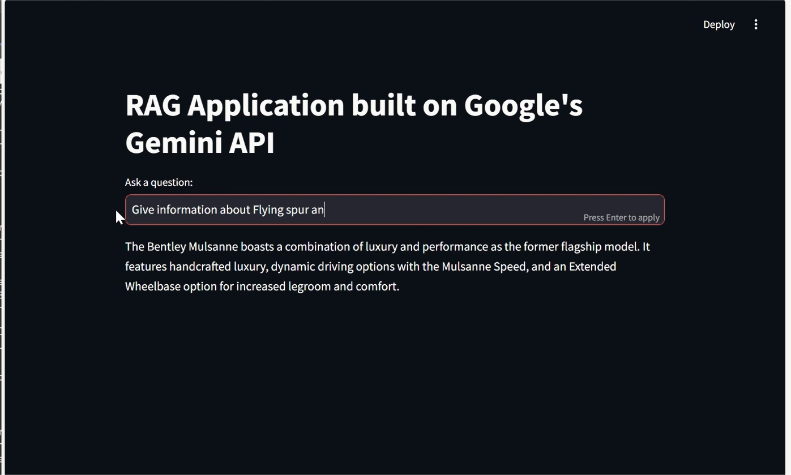

# RAG Application Built on Google's Gemini API with Bentley Data

This project is a Retrieval-Augmented Generation (RAG) application that leverages Google's Gemini API for advanced natural language processing and document retrieval. The application is designed to answer questions by retrieving relevant documents from provided URLs and generating concise answers using the Gemini model.

## Features

- **Document Retrieval**: Uses Chroma as a vector store to retrieve relevant documents based on similarity.
- **Question-Answering**: Powered by Google's Gemini API to generate accurate and concise answers.
- **Streamlit Integration**: A user-friendly interface to interact with the application.

## Demo

You can see a working demonstration of the project in the video below:

[](RAG_demonstration.mp4)

> Click on the image to play the video.

## Installation

1. Clone the repository:
   ```bash
   git clone https://github.com/yourusername/RAG_project.git
   cd RAG_project

2. Create a virtual environment and activate it:
   ```bash
   python -m venv env
   source env/bin/activate  # On Windows use `env\Scripts\activate`

3. Install the dependencies:
   ```bash
   pip install -r requirements.txt

4. Set up environment variables:
   - Create a .env file in the root directory.
   - Add your Google API key and any other required environment variables.
  

## Usage
1. Run the Streamlit application:
   ```bash
   streamlit run app1.py
2. Open your browser and navigate to the provided local URL to interact with the application.

## Project Structure

- **app1.py**: Main application script.
- **requirements.txt**: List of required Python packages.
- **.env**: Environment variables file (not included in the repository).
- **RAG_demonstration.mp4**: Demonstration video.

## About Bentley Data

This project utilizes data from Bentley's official website, including information on accessories, history, heritage, and hybrid models, to demonstrate the capabilities of a Retrieval-Augmented Generation (RAG) system built on Google's Gemini API.


## Technologies Used

- **Streamlit**: For building the web interface.
- **LangChain**: For handling document retrieval and processing.
- **Chroma**: As the vector store for document retrieval.
- **Google's Gemini API**: For generating answers to queries.
